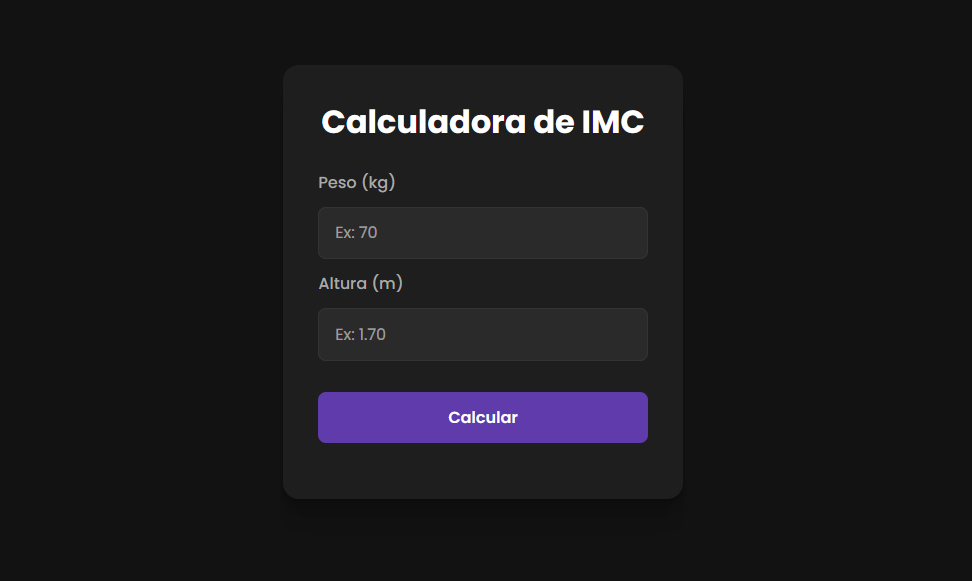

# BMI Calculator 🧮


> Calculadora de IMC desenvolvida com JavaScript puro, com modal interativo que muda de cor de acordo com o resultado do cálculo.

### ✨ [Veja o site ao vivo aqui!](https://anaflgg.github.io/bmi-calculator-js/)

---

### 📸 Screenshot


---

### 📖 Sobre o Projeto
Calculadora de IMC que recebe peso e altura, calcula o índice e exibe o resultado em um modal com overlay e blur. O modal muda de cor conforme a categoria: verde claro para abaixo do peso, verde para peso normal, amarelo para sobrepeso e laranja para obesidade.

---

### 🚀 Tecnologias Utilizadas
- HTML5
- CSS3
- JavaScript
- Google Fonts (Poppins)

---

### 🧠 Aprendizados
- Manipulação do DOM com JavaScript puro
- Criação e controle de modal com overlay e backdrop-filter
- Troca dinâmica de classes CSS via JavaScript
- Validação de inputs com parseFloat
- Commits semânticos e uso de branches no Git

---

### 🐛 Desafios e Soluções
- O modal aparecia dentro do container em vez de cobrir a tela toda. Resolvido movendo o elemento pra fora do `<main>` e usando `position: fixed` com `inset: 0`.
- As setas nativas do `input[type="number"]` quebravam o visual. Removidas com `-webkit-appearance: none` e `-moz-appearance: textfield`.

---

### 📝 Atualizações

- **v1.1** — Aceita altura sem ponto (ex: 192 → 1.92), com vírgula (ex: 1,72) e bloqueia letras no input.

---

### 👷 Como executar o projeto
Projeto estático, não precisa instalar nada.

1. Clone o repositório:
```bash
git clone https://github.com/anaflgg/bmi-calculator-js.git
```